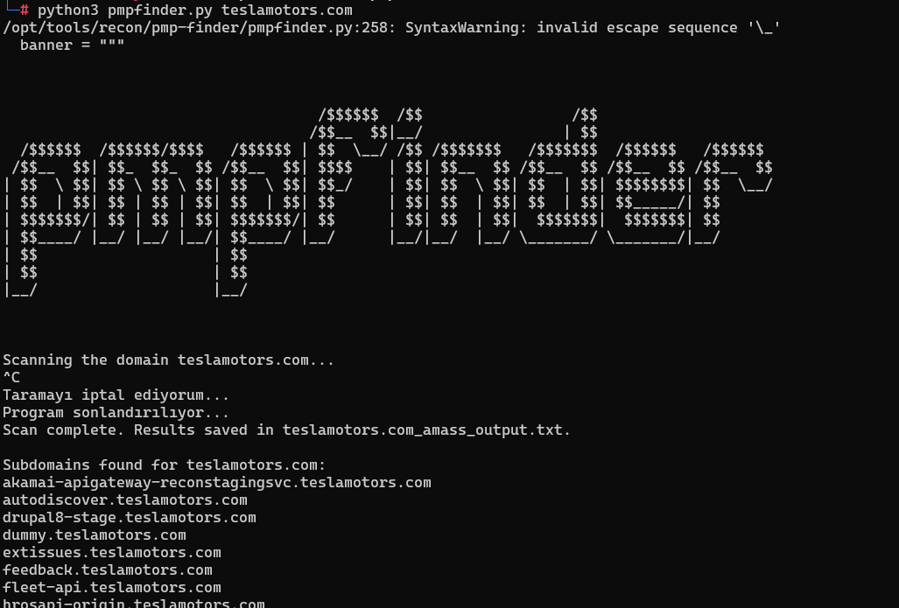

# PMPFinder - Subdomain and GitHub Dork Finder

This project is a Python script designed to discover subdomains of a given domain and find its GitHub dorks. The results will be saved in a file.



## Requirements

To install the required dependencies for the project, follow these steps:

1. Navigate to the project folder.
2. Install the required Python dependencies using the `requirements.txt` file by running the following command:

   ```bash
   cd pmp-finder
   ```
   ```bash
   pip install -r requirements.txt
   ```

3. grant execution permission and settings conf file
   
   ```bash
   chmod +x puredns
   ```
   ```bash
   sudo mkdir -p /root/.config/puredns
   ```
   ```bash
   cp resolvers/resolvers.txt /root/.config/puredns/resolvers.txt
   ```
4. if you can use virustotal scan, you need to save the virustotal api to key.txt file, dont forget


### Additional Tools

This script requires additional tools for subdomain discovery and GitHub dork search:

- **httprobe**,**masscan**,**subfinder**,**assetfinder**,**massdns**, and **amass** need to be installed.

## Usage

### Options and Arguments

Here are the available options for using the script:

- **`--type TYPE`**: Comma separated list of tools to use (e.g., 'subfinder,assetfinder,amass'). This option is required.
- **`--bruteforce`**: Run bruteforce subdomain enumeration.
- **`-w W`**: Wordlist for bruteforce (default: `resolvers/min-sub.txt`).
- **`--rate-limit RATE_LIMIT`**: Rate limit for bruteforce (default: `100`).
- **`--rate-limit-trusted RATE_LIMIT_TRUSTED`**: Rate limit for trusted domains (default: `500`).
- **`--onefile`**: Merge and save results into a single file.
- **`--virustotal `**: Enable VirusTotal API for subdomain discovery.

### Examples

1. **Run with subdomain enumeration tools (subfinder, assetfinder, amass) and bruteforce:**

   ```bash
   python pmpfinder.py teslamotors.com --type subfinder,assetfinder,amass --bruteforce -w resolvers/output_part_1.txt --rate-limit 100 --rate-limit-trusted 500 --onefile
   ```

2. **Run with subdomain enumeration tools (subfinder, assetfinder) without bruteforce:**

   ```bash
   python pmpfinder.py teslamotors.com --type subfinder,assetfinder
   ```

3. **Run with subdomain enumeration tools (subfinder, amass) and bruteforce:**

   ```bash
   python pmpfinder.py teslamotors.com --type subfinder,amass --bruteforce -w resolvers/output_part_1.txt --rate-limit 100 --rate-limit-trusted 500
   ```

4. **Run with bruteforce only (without any other tools):**

   ```bash
   python pmpfinder.py teslamotors.com --bruteforce -w resolvers/output_part_1.txt --rate-limit 100 --rate-limit-trusted 500
   ```

## Output

When the script runs, the following output files will be created:

```
<domain>_subdomains.txt
<domain>http_subdomains.txt
<domain>_github_dorks.txt
```

These files will contain the discovered subdomains and GitHub dorks for the domain.
